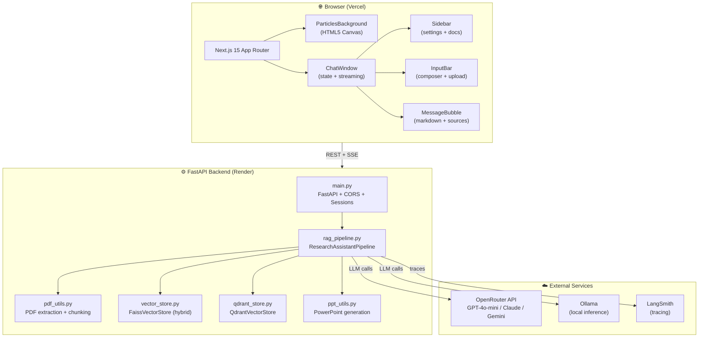
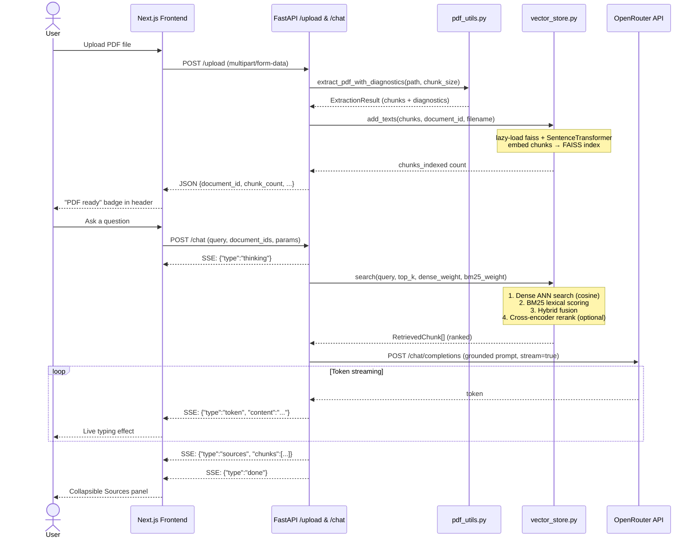
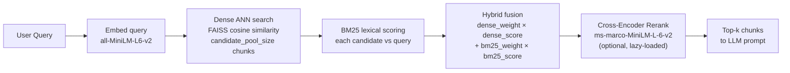

# Architecture — Multimodal AI Research Assistant

## System Overview

A full-stack, document-grounded conversational AI assistant. Users upload research PDFs, ask questions in natural language, and receive streamed answers grounded in retrieved evidence from their documents.

---

## High-Level Architecture Diagram



---

## Data Flow — PDF Upload → Streamed Answer



---

## Repository Directory Tree

```
capstone2draft2/
├── backend/                        # Python FastAPI backend
│   ├── main.py                     # App factory, CORS, all API endpoints
│   ├── rag_pipeline.py             # Core RAG pipeline (ingest, retrieve, stream, compare, PPT)
│   ├── vector_store.py             # FAISS-based hybrid vector store (lazy ML imports)
│   ├── qdrant_store.py             # Qdrant-based vector store (alternative provider)
│   ├── pdf_utils.py                # PDF text extraction, chunking, diagnostics
│   ├── ppt_utils.py                # python-pptx PowerPoint deck generation
│   ├── requirements.txt            # Python dependencies
│   ├── pytest.ini                  # Test configuration
│   ├── railway.toml                # Railway deployment config
│   ├── .env                        # Local secrets (gitignored)
│   ├── .env.example                # Template for all env vars
│   ├── storage/                    # Local FAISS index + chunk metadata (gitignored)
│   └── tests/                      # 34 pytest unit/integration tests
│       ├── test_ingestion.py       # PDF upload + chunking tests
│       ├── test_retrieval.py       # Hybrid retrieval accuracy tests
│       ├── test_reranking.py       # Cross-encoder reranker tests
│       ├── test_compare.py         # Multi-document comparison tests
│       └── test_api.py             # FastAPI endpoint tests
│
├── frontend/                       # Next.js 15 TypeScript frontend
│   ├── app/
│   │   ├── layout.tsx              # Root layout (fonts: Manrope + IBM Plex Mono)
│   │   ├── page.tsx                # Entry point → renders ChatWindow
│   │   ├── globals.css             # Global styles, CSS vars, particle/slider CSS
│   │   └── components/
│   │       ├── ChatWindow.tsx      # Main orchestrator: state, upload, streaming, routing
│   │       ├── Sidebar.tsx         # Collapsible settings panel with smooth animation
│   │       ├── InputBar.tsx        # Sticky message composer with PDF upload button
│   │       ├── MessageBubble.tsx   # Chat message renderer (user + assistant roles)
│   │       ├── MarkdownRenderer.tsx# react-markdown with GFM tables support
│   │       ├── CodeBlock.tsx       # Syntax-highlighted code with copy button
│   │       └── ParticlesBackground.tsx  # HTML5 Canvas neural-constellation animation
│   ├── lib/
│   │   ├── api.ts                  # All fetch calls to backend (upload, chat, compare, PPT)
│   │   └── utils.ts                # cn() Tailwind class merger utility
│   ├── tailwind.config.ts          # Custom colors, animations, keyframes
│   ├── next.config.ts              # Next.js configuration
│   └── .env.local                  # NEXT_PUBLIC_API_BASE_URL (gitignored)
│
├── render.yaml                     # Render.com backend deployment config
├── ARCHITECTURE.md                 # This file
├── REPO_SUMMARY.md                 # Full repo overview
├── Final_Report_Capstone_II_Group77.md   # Capstone final report (markdown)
├── Final_Report_Capstone_II_Group77.docx # Capstone final report (Word)
└── README.md                       # Project readme
```

---

## Backend File Responsibilities

| File | Responsibility |
|---|---|
| `main.py` | FastAPI app factory, CORS middleware, session-based pipeline routing, all 9 API endpoints |
| `rag_pipeline.py` | `ResearchAssistantPipeline` — ingest, retrieve, rerank, stream chat, stream compare, generate PPT, evaluate retrieval |
| `vector_store.py` | `FaissVectorStore` — FAISS IndexFlatIP, BM25 lexical scoring, hybrid fusion, lazy ML imports |
| `qdrant_store.py` | `QdrantVectorStore` — persistent Qdrant local embedded, per-document collections |
| `pdf_utils.py` | `extract_pdf_with_diagnostics` — pypdf extraction, overlap chunking, empty page detection |
| `ppt_utils.py` | `generate_pptx_deck` — 16:9 widescreen PPTX with title + content slides, emerald theme |

---

## Frontend Component Responsibilities

| Component | Responsibility |
|---|---|
| `ChatWindow.tsx` | Root state container: messages, documents, upload, streaming SSE reader, compare, PPT trigger |
| `Sidebar.tsx` | Collapsible settings panel: provider/model selector, retrieval sliders, document list with checkboxes |
| `InputBar.tsx` | Sticky composer at bottom: textarea, send button, + button for PDF upload |
| `MessageBubble.tsx` | Renders one message: role alignment, markdown, thinking indicator, collapsible Sources panel |
| `MarkdownRenderer.tsx` | `react-markdown` + `remark-gfm` with custom renderers for tables, code, links |
| `CodeBlock.tsx` | `react-syntax-highlighter` (Prism) with one-click copy button |
| `ParticlesBackground.tsx` | HTML5 Canvas: 90 particles, glow halos, constellation lines, mouse-repulsion physics |

---

## API Endpoints

| Method | Route | Purpose | Auth |
|---|---|---|---|
| `GET` | `/` | Health check — returns status, doc count, vector store info | None |
| `POST` | `/upload` | Upload + ingest PDF — extract, chunk, embed, store | None |
| `GET` | `/documents` | List all indexed documents with metadata | None |
| `POST` | `/reset` | Clear chat / single document / all documents | None |
| `POST` | `/chat` | Hybrid retrieve + rerank + stream LLM answer (SSE) | None |
| `POST` | `/compare` | Multi-document structured comparison (SSE) | None |
| `POST` | `/generate-ppt` | Generate + download PowerPoint deck | None |
| `POST` | `/retrieval/debug` | Inspect raw retrieval results for a query | None |
| `POST` | `/retrieval/evaluate` | Compute term-recall + hit-rate metrics | None |

### SSE Event Types (`/chat`, `/compare`)
```json
{"type": "thinking"}
{"type": "token", "content": "The paper proposes..."}
{"type": "sources", "chunks": [...]}
{"type": "done"}
{"type": "error", "message": "..."}
```

---

## Retrieval Pipeline Detail



Default weights: `dense=0.72`, `bm25=0.28`, `candidate_pool=24`, `top_k=4`

---

## Environment Variables Reference

### Backend (`.env` / Render Environment)

| Variable | Default | Description |
|---|---|---|
| `OPENROUTER_API_KEY` | — | **Required.** OpenRouter API key |
| `OPENROUTER_BASE_URL` | `https://openrouter.ai/api/v1` | OpenRouter endpoint |
| `OPENROUTER_MODEL` | `openai/gpt-4o-mini` | Default model |
| `OPENROUTER_SITE_URL` | `http://localhost:3000` | Your frontend URL (for OpenRouter headers) |
| `OPENROUTER_APP_NAME` | `Multimodal AI Research Assistant` | App name in OpenRouter headers |
| `OLLAMA_BASE_URL` | `http://localhost:11434` | Local Ollama endpoint |
| `EMBEDDING_MODEL` | `sentence-transformers/all-MiniLM-L6-v2` | Sentence transformer model |
| `RERANKER_MODEL` | `cross-encoder/ms-marco-MiniLM-L-6-v2` | Cross-encoder reranker model |
| `VECTOR_DB_PROVIDER` | `faiss` | `faiss` or `qdrant` |
| `VECTOR_STORE_DIR` | `storage` | Directory for FAISS index files |
| `QDRANT_URL` | — | Qdrant Cloud URL (if using hosted Qdrant) |
| `QDRANT_API_KEY` | — | Qdrant Cloud API key |
| `MAX_UPLOAD_BYTES` | `15728640` | Max PDF size (15 MB) |
| `MODEL_TIMEOUT_SECONDS` | `45` | LLM request timeout |
| `FRONTEND_ORIGINS` | — | Comma-separated allowed frontend URLs (CORS) |
| `LANGSMITH_TRACING` | `false` | Enable LangSmith pipeline tracing |
| `LANGSMITH_API_KEY` | — | LangSmith API key |
| `LANGSMITH_ENDPOINT` | `https://api.smith.langchain.com` | LangSmith endpoint |
| `LANGSMITH_PROJECT` | `capstone2draft2` | LangSmith project name |

### Frontend (`.env.local` / Vercel Environment)

| Variable | Description |
|---|---|
| `NEXT_PUBLIC_API_BASE_URL` | Full URL of deployed backend e.g. `https://....onrender.com` |

---

## Technology Choices

| Technology | Why Chosen |
|---|---|
| **Next.js 15** | App Router, RSC support, fast HMR, excellent TypeScript DX |
| **Tailwind CSS** | Utility-first — rapid iteration on custom dark glassmorphic design |
| **HTML5 Canvas** | Custom particle physics without external library overhead |
| **FastAPI** | Async Python, native streaming, clean Pydantic validation |
| **FAISS** | Production-grade ANN search, CPU-friendly, zero infra overhead |
| **Qdrant (local)** | Persistent disk storage across restarts, rich payload filtering |
| **all-MiniLM-L6-v2** | Best speed/quality tradeoff for retrieval; small enough for CPU |
| **ms-marco-MiniLM-L-6-v2** | Cross-encoder reranker trained on MS MARCO; significantly improves precision |
| **BM25 hybrid** | Covers lexical exact-match queries that dense embeddings miss |
| **Lazy ML imports** | Defers PyTorch + faiss load to first upload — keeps startup RAM < 100MB (critical for Render free tier) |
| **OpenRouter** | Multi-model API under one key; GPT-4o, Claude, Gemini, Llama all available |
| **LangSmith** | Pipeline observability with per-step tracing and latency metrics |
| **python-pptx** | Programmatic PPTX generation with full layout control |
| **pypdf** | Lightweight PDF text extraction with page metadata |

---

## Session Architecture

The backend supports multiple concurrent users via session isolation:

```
Request Header: X-Session-ID: <uuid>
                      ↓
          pipelines[session_key] = ResearchAssistantPipeline(
              storage_dir = VECTOR_STORE_DIR / session_key
          )
```

Each session gets its own `ResearchAssistantPipeline` instance with isolated FAISS storage. If no `X-Session-ID` header is sent, the `"default-session"` key is used.

---

## Deployment Architecture

```
GitHub (main branch)
    │
    ├─── Auto-deploy → Render.com
    │         FastAPI backend
    │         Port: $PORT (dynamic)
    │         Health: GET /
    │
    └─── Auto-deploy → Vercel
              Next.js frontend
              NEXT_PUBLIC_API_BASE_URL=https://...onrender.com
```
